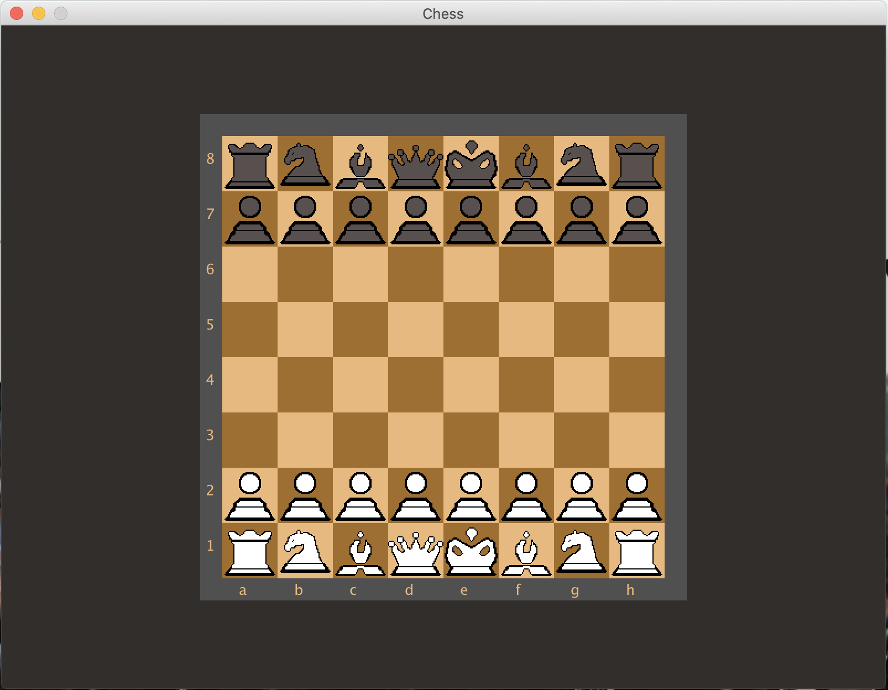
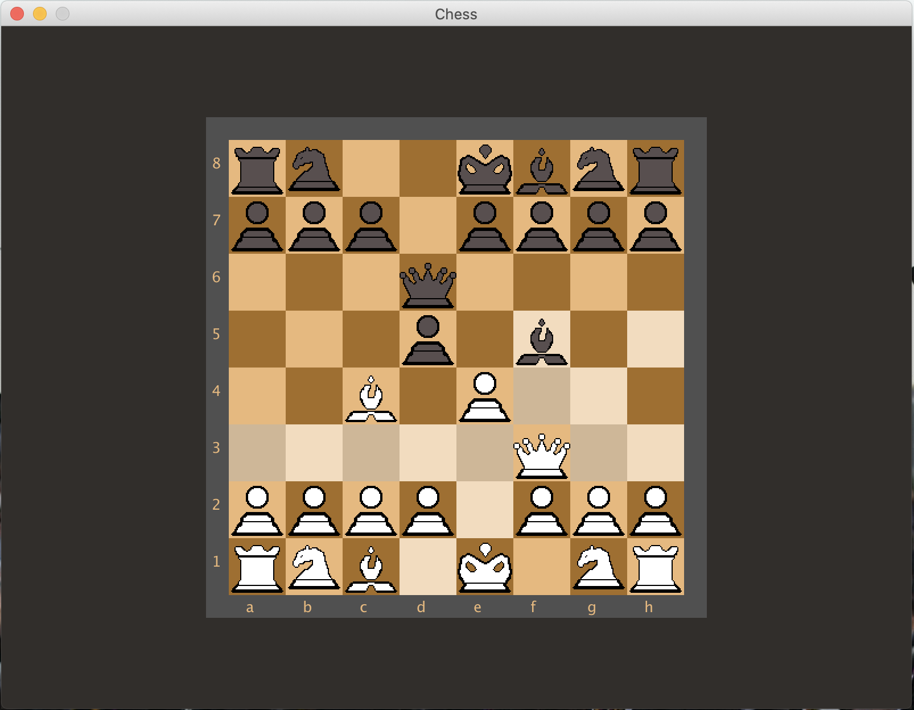

# Chess - Java
A Chess application written in Java, utilizing the JPanel and JFrame libraries to create a functional user interface.

- Features:
	- Implements standard chess rules: white plays first, castling, check, and checkmate.
	- When a piece is selected,  all legal moves will be highlighted on the board.

# Information
This application is a work-in-progress and will be constantly updated at varying intervals of time. This project was created as a means for me to learn more about user interface development as well as game-design using the object-oriented programming paradigm.

# Room for improvement
- Create a reset functionality to set all pieces to their default positions.
- Occasionally, users may have to click on an empty piece to reset the piece selection. This error has an unknown cause and will be fixed as soon as possible.
- Pieces created using gimp, currently looking to update the piece models to enhance the game aesthetically.

# Screenshots

